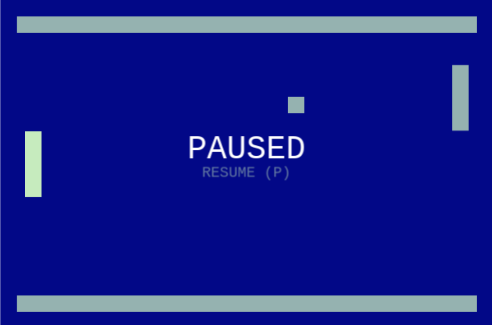

# Just Pong: a multiplayer game made with Phaser 3

Explore the repository [here](https://github.com/diegovinie/just-pong).
## How to play
- Go to the game [here](dist/)
- Click on *single button* to start playing right away
- In case you want to play multiplayer click un *multiplayer button*, if it doesn't start, it will wait for another player.
- Move your paddle with `W` (up) and `S` (down) if you are at the left and the `arrows up and down` if you are on the right.
- Press `P` to pause/resume.
- The match never ends!

## Features
Single and multiplayer (up to 2, it's Pong of course)

### Tech Notes:
- Multiplayer is managed by a (very basic) web socket server, so it should be able to deal with many matches at the same time.
- The players send their inputs, the server broadcasts them and finally, all the clients receive them and move the game object, this might save data transfer size, but it also leads to synchronization problems, further I will send a message to sync all clients.
- It's built using rectangles and text only, and most of the dimensions and colors are parametrized, making it easy to customize.
- I created a text button component, but it is still pending the navigation with arrows and tabs.
- I created a Grid component to help position text and buttons.

## Development
Uses [Phaser 3 TypeScript Project Template](https://github.com/photonstorm/phaser3-typescript-project-template). Notes from the original template.

### Requirements

[Node.js](https://nodejs.org) is required to install dependencies and run scripts via `npm`.

### Available Commands

| Command | Description |
|---------|-------------|
| `npm install` | Install project dependencies |
| `npm run watch` | Build project and open web server running project, watching for changes |
| `npm run dev` | Builds project and open web server, but do not watch for changes |
| `npm run build` | Builds code bundle with production settings (minification, no source maps, etc..) |

### Writing Code

After cloning the repo, run `npm install` from your project directory. Then, you can start the local development
server by running `npm run watch`.

### Configuring Rollup

* Edit the file `rollup.config.dev.js` to edit the development build.
* Edit the file `rollup.config.dist.js` to edit the distribution build.

You will find lots of comments inside the rollup config files to help you do this.

Note that due to the build process involved, it can take around 20 seconds to build the initial bundle. Times will vary based on CPU and local drive speeds. The development config does not minify the code in order to save build time, but it does generate source maps. If you do not require these, disable them in the config to speed it up further.

### Versions Used

* Phaser 3.60
* TypeScript 5.0.3
* Rollup 3.20.2
* Rollup Plugins:
  * @rollup/plugin-commonjs 24.0.1
  * @rollup/plugin-node-resolve 15.0.2
  * @rollup/plugin-replace 5.0.2
  * @rollup/plugin-terser 0.4.0
  * @rollup/plugin-typescript 11.1.0
  * rollup-plugin-serve 2.0.2
